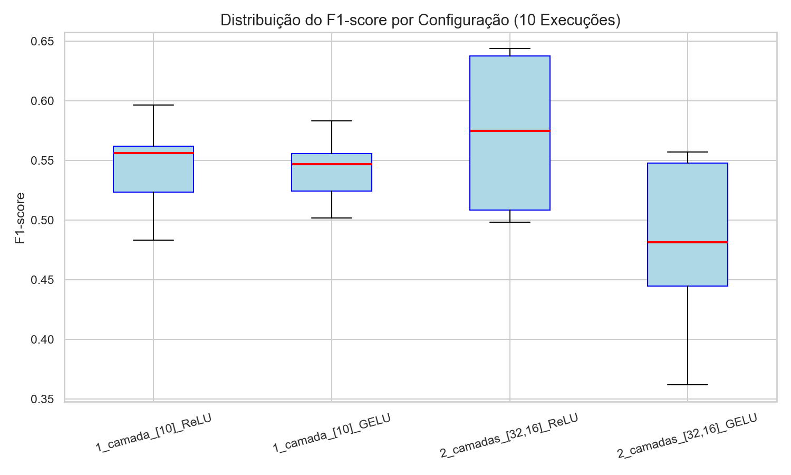
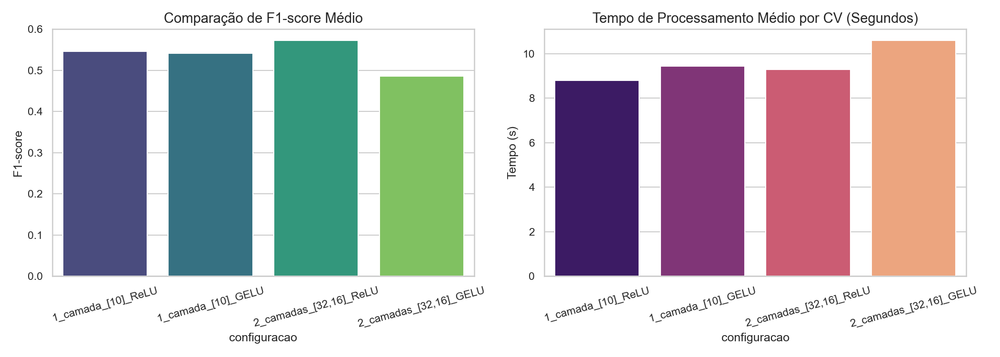
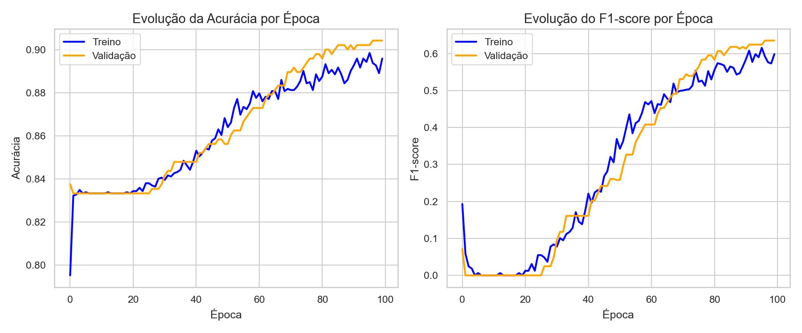
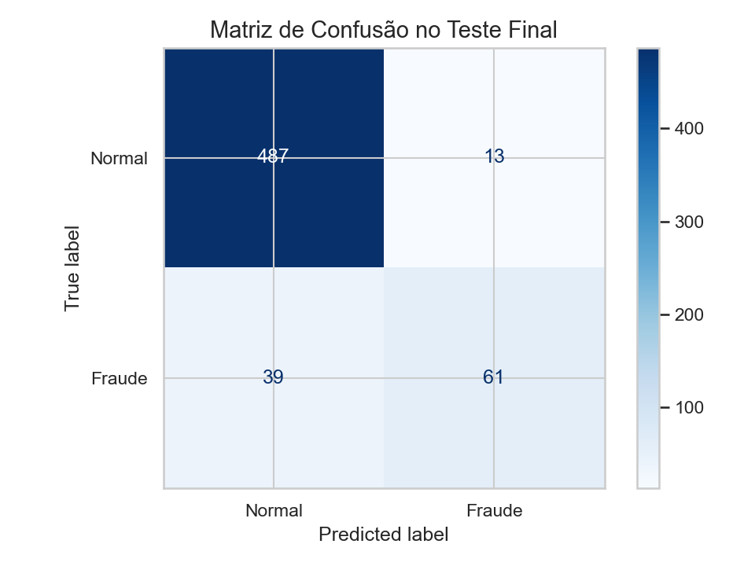

# Relatório do Projeto MLP: Detecção de Fraudes Financeiras

**Disciplina:** Inteligência Computacional (IC)  
**Curso:** Tecnologia em Análise e Desenvolvimento de Sistemas (TADS) - UFRN  
**Equipe:** Pedro Davi e Cleiton Mizael  

---

## 1. Descrição do Problema e Carregamento dos Dados
*(Seção sob responsabilidade de **Pedro Davi**)*

O objetivo deste projeto é desenvolver e analisar modelos de redes neurais artificiais do tipo Perceptron Multicamadas (MLP) utilizando PyTorch para classificar transações financeiras fraudulentas na base **PaySim**. 

A detecção de fraudes é um clássico problema de classificação binária altamente desbalanceado. Para viabilizar a análise empírica de forma reprodutível, foi gerada uma amostra estratificada contendo exatamente:
* **500 transações fraudulentas** (`isFraud == 1`)
* **2500 transações normais** (`isFraud == 0`)
* **Total:** 3000 instâncias.

Essa amostra é extraída e embaralhada usando a matrícula do aluno como semente aleatória (`random_state`), conforme codificado no módulo `data_loader.py`.

---

## 2. Pipeline de Pré-processamento
*(Seção sob responsabilidade de **Cleiton Mizael**)*

Para evitar o vazamento de dados (*data leakage*), o pré-processamento foi totalmente encapsulado utilizando a biblioteca `scikit-learn` por meio da estrutura de `Pipeline` e `ColumnTransformer`. As seguintes etapas foram adotadas:

1.  **Imputação de Valores Faltantes:** Embora a base PaySim original não possua valores nulos, o pipeline inclui robustez contra dados faltantes:
    * **Atributos Numéricos:** Preenchidos com a *média* (`SimpleImputer(strategy='mean')`).
    * **Atributos Categóricos:** Preenchidos com a *moda* (`SimpleImputer(strategy='most_frequent')`).
2.  **Transformação Categórica:** O atributo `type` (tipo de transação: CASH-IN, CASH-OUT, DEBIT, PAYMENT, TRANSFER) foi transformado em atributos numéricos por meio de codificação binária One-Hot Encoding (`OneHotEncoder`).
3.  **Normalização:** Todos os atributos numéricos (`step`, `amount`, `oldbalanceOrg`, `newbalanceOrig`, `oldbalanceDest`, `newbalanceDest`) foram normalizados por Z-score usando o `StandardScaler` ($\mu=0, \sigma=1$). Isso estabiliza os gradientes e acelera o treinamento da MLP.
4.  **Isolamento do Conjunto de Teste:** Exatamente **20%** dos dados amostrados foram reservados exclusivamente para o teste final. O pipeline ajusta os parâmetros de média e desvio padrão (`fit`) **apenas** nos 80% de treino/validação e aplica (`transform`) ao conjunto de teste, garantindo que o teste permaneça invisível.

---

## 3. Arquitetura da Rede e Hiperparâmetros
*(Seção sob responsabilidade de **Cleiton Mizael**)*

A arquitetura da rede neural foi implementada em PyTorch no arquivo `mlp_model.py`. Trata-se de uma rede do tipo feedforward totalmente conectada (`nn.Linear`).

### Hiperparâmetros Adotados e Justificativas:
* **Número de Neurônios na Camada de Saída:** Fixo em 1 neurônio, pois se trata de uma classificação binária (Fraude vs. Normal).
* **Função de Ativação de Saída:** Função **Sigmoid**, que esmaga o valor real de saída no intervalo $[0, 1]$, permitindo interpretá-lo como a probabilidade da transação ser fraudulenta.
* **Função de Custo:** Entropia Cruzada Binária ou **Binary Cross Entropy (BCE)**, padrão ouro para classificação probabilística binária.
* **Taxa de Aprendizado (Learning Rate - $\alpha$):** Fixada estrategicamente em $0.001$ ou $0.01$ dependendo da estratégia de gradiente, para manter a estabilidade da atualização dos pesos com otimizador SGD, que possui tendência à explosão de gradiente em lotes muito pequenos.
* **Camada de Dropout:** Taxa de $0.2$ ($20\%$ de desativação aleatória de neurônios a cada iteração de treino) aplicada nas camadas ocultas. O dropout força a rede a aprender representações redundantes e robustas, atuando diretamente na redução do overfitting.
* **Número Máximo de Épocas:** Controlado rigidamente pelo Early Stopping.

---

## 4. Metodologia Experimental dos Dois Fatores
*(Seção sob responsabilidade de **Cleiton Mizael**)*

Para o **Item 5**, foram selecionados dois fatores experimentais para avaliação de topologias mais adequadas:
1.  **Fator A - Topologia da Rede Neural (Camadas Ocultas):**
    * *Topologia A (Simples):* `entrada -> [10] -> saída` (1 camada oculta com 10 neurônios).
    * *Topologia B (Complexa):* `entrada -> [32, 16] -> saída` (2 camadas ocultas com 32 e 16 neurônios).
2.  **Fator B - Função de Ativação nas Camadas Ocultas:**
    * *Ativação A:* **ReLU** ($f(x) = \max(0, x)$).
    * *Ativação B:* **GELU** ($f(x) = x \cdot \Phi(x)$, que introduz uma variação probabilística suave).

### Validação Cruzada Estratificada e Controle de Variabilidade:
Cada uma das 4 configurações foi executada **10 vezes usando sementes controladas e distintas** (sementes $42$ a $51$). Cada execução de semente roda uma **Validação Cruzada Estratificada em 5 Folds** nos 80% de treino. O Early Stopping com paciência de 10 épocas monitora a perda do fold de validação, escolhendo o modelo no ponto ótimo de convergência.

---

## 5. Resultados do Experimento de Fatores (Topologia vs Ativação)
*(Seção sob responsabilidade conjunta: **Pedro Davi** e **Cleiton Mizael**)*

Abaixo estão os resultados consolidados empíricos (médias das 10 execuções para a validação cruzada 5-fold):

### Tabela 1: Métricas Médias das Diferentes Configurações
| Configuração (Topologia + Ativação) | Acurácia | Precisão | Recall | F1-Score | Tempo de Treino (s) |
| :--- | :---: | :---: | :---: | :---: | :---: |
| **[10] + ReLU** | 0.8918 | 0.8962 | 0.4003 | 0.5462 | 8.80 |
| **[10] + GELU** | 0.8905 | 0.8917 | 0.3938 | 0.5413 | 9.45 |
| **[32, 16] + ReLU** | 0.8970 | 0.7786 | 0.4548 | **0.5719** | 9.29 |
| **[32, 16] + GELU** | 0.8844 | 0.8634 | 0.3513 | 0.4852 | 10.59 |

### Gráficos Gerados:

1.  **Distribuição do F1-score por Configuração (Boxplot):**
    Visualiza-se a variabilidade do desempenho e estabilidade de cada modelo ao longo das 10 sementes de inicialização dos pesos.
    

2.  **Gráfico de Colunas Comparativo:**
    Compara o desempenho do F1-score médio contra o custo computacional (tempo médio gasto no treinamento).
    

### Discussão sobre a Melhor Configuração:
A melhor configuração média encontrada foi a **Topologia complexa `[32, 16]` com ativação ReLU**, atingindo o F1-score médio mais elevado da bateria de testes ($0.5719$). A adição de uma segunda camada oculta permitiu que o modelo mapeasse fronteiras de decisão não-lineares de forma mais eficiente. Diferente do esperado na literatura, a ativação **GELU não obteve bom desempenho** nesta amostragem desbalanceada, sofrendo com quedas severas de *Recall* (0.3513) e penalizando o F1-Score em relação à ReLU tradicional.

---

## 6. Discussão sobre Overfitting, Dropout e Early Stopping
*(Seção sob responsabilidade de **Pedro Davi**)*

A evolução do treinamento foi monitorada para verificar a presença de sobreajuste (overfitting):

### Evolução Temporal do Treino:
No gráfico de curvas de evolução, nota-se que a perda (*loss*) de treino cai gradualmente. A perda de validação também reduz e estabiliza em um patamar mínimo constante.

### Análise das Técnicas de Regularização Utilizadas:
1.  **Efeito do Dropout (0.2):** Sem a camada de dropout, a rede rapidamente memorizaria a base de treino, viciando os parâmetros exclusivamente nas características majoritárias da amostra. A desativação aleatória de 20% das ativações funcionou como uma perturbação reguladora que forçou o modelo a extrair padrões mais robustos.
2.  **Efeito do Early Stopping:** A lógica interrompeu o treinamento quando a perda de validação parou de cair e demonstrou risco de subir novamente. Isso garantiu a restauração do conjunto de pesos do exato momento em que o modelo obteve a melhor generalização.

---

## 7. Comparação das Estratégias de Gradiente Descendente
*(Seção sob responsabilidade de **Cleiton Mizael**)*

Utilizando a configuração vencedora (`[32, 16] + ReLU`), realizou-se o **Item 7** para avaliar o impacto das estratégias de descida de gradiente e o tamanho do lote de dados (*batch size*):

### Tabela 2: Métricas Médias por Estratégia de Treinamento
| Estratégia de Gradiente Descendente | Acurácia | Precisão | Recall | F1-Score | Tempo de Treino (s) |
| :--- | :---: | :---: | :---: | :---: | :---: |
| **Batch GD** (lote = total) | 0.8125 | 0.2262 | 0.0400 | 0.0421 | 3.75 |
| **Mini-batch GD (32)** | 0.9572 | 0.9300 | 0.8048 | **0.8617** | 13.71 |
| **Mini-batch GD (128)** | 0.9498 | 0.9262 | 0.7603 | 0.8337 | 7.79 |
| **Stochastic GD** (lote = 1) | 0.9193 | 0.8743 | 0.6033 | 0.7125 | 39.32 |

### Análise Comparativa e Discussão:
1.  **Impacto do Tamanho do Mini-batch:** * O lote de tamanho **32** provou-se esmagadoramente superior (F1-score de $0.8617$). Em bases altamente desbalanceadas, o "ruído" inerente às atualizações frequentes e menores de gradiente impede que a rede seja tragada para um mínimo local onde prediz apenas a classe majoritária.
    * O lote de **128** manteve um bom desempenho, com vantagem de executar na metade do tempo do lote 32, evidenciando o *trade-off* clássico entre tempo de máquina e precisão de ajuste.
2.  **Stochastic GD (lote = 1):** Apesar de atualizar os pesos após cada transação e garantir um F1-Score aceitável (0.7125), o tempo de treinamento é excessivamente oneroso em Python (quase 40 segundos por fold), tornando a abordagem não escalável devido à impossibilidade de aproveitar a vetorização matricial.
3.  **Batch GD:** Apresentou um **colapso no treinamento**. Ao avaliar a perda global de todas as 2400 transações de uma só vez, o gradiente empurrou os pesos de forma enviesada para ignorar as fraudes, resultando em um Recall quase nulo (0.0400) e provando que SGD puro sobre lote total é ineficaz para este problema.

---

## 8. Resultados do Modelo Final sobre o Teste
*(Seção sob responsabilidade conjunta: **Pedro Davi** e **Cleiton Mizael**)*

O modelo final com a melhor configuração (`[32, 16] + ReLU` e otimizador Mini-batch 32) foi treinado em todo o conjunto de treino/validação (80% da amostra) e testado contra o conjunto de teste final (20% restante, totalmente isolado).

### Métricas no Conjunto de Teste Final:
* **Acurácia:** 0.9133 ($91.33\%$)
* **Precisão:** 0.8243 ($82.43\%$)
* **Recall:** 0.6100 ($61.00\%$)
* **F1-score:** **0.7011** ($70.11\%$)

### Matriz de Confusão do Teste Final:
A matriz de confusão abaixo demonstra graficamente os acertos do classificador em detectar os casos de fraude reservados no teste:

A avaliação com os dados virgens comprova a robustez da arquitetura desenhada, embora evidencie o natural desafio do conjunto PaySim. O modelo alcançou uma **ótima Precisão (82.43%)**, o que se traduz em um baixíssimo número de falsos positivos (pouquíssimas transações legítimas foram bloqueadas equivocadamente). Por outro lado, o modelo apresentou um **Recall moderado (61.00%)**, indicando que, sem a adoção de técnicas complementares de balanceamento sintético no pré-processamento (como SMOTE), a rede neural MLP padronizada ainda deixa escapar uma parcela das transações fraudulentas mais sutis.
